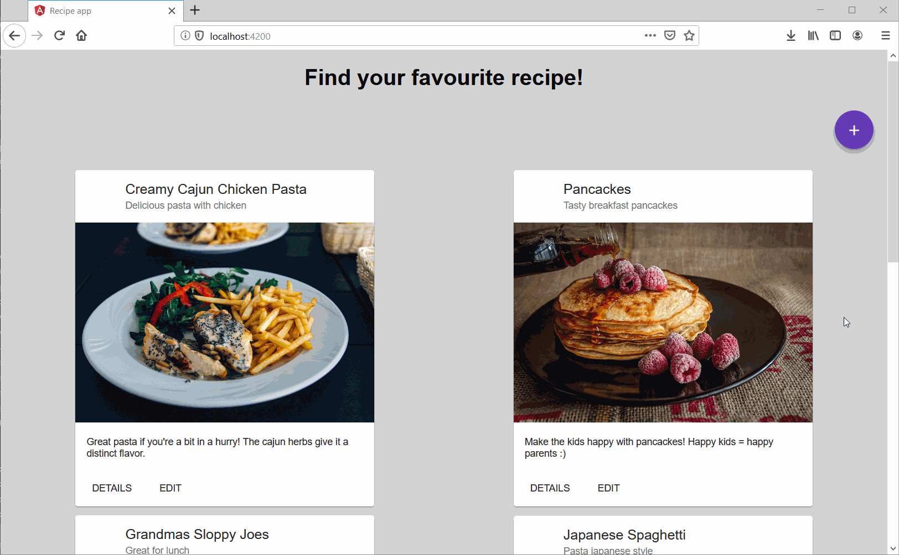

# Recipe App Single Page Application

Recipe web app as next step in the evolution for this FreeCodeCamp [challenge](https://www.freecodecamp.org/challenges/build-a-recipe-box).
In 2017/2018 I followed most of the freeCodeCamp program, and created my first version of this app with react and storage in the browser, with a [codepen](https://codepen.io/marc1980/full/KqoPwe)
Last year I learned C# and ASP.NET, and created a [new version](https://github.com/marc1980/RecipeApp) of the recipe app with ASP.NET MVC.
This is itteration 3 of my recipe app. I made this project to experience the main differences for a developer between a server side rendered ASP.NET MVC application, and a seperate backend API and SPA frontend. Just wanted to form my own opinion :)

This project consists of 2 parts:
1. ASP.NET core Web API
2. Angular frontend

## Backend

The backend uses ASP.NET Web API and for storage I used entity framework in combination with SQLite (for compability with MacOS).

## Frontend

The frontend uses an angular service to connect to the backend, and angular components with the angular material UI famework for the list and display functionality. For create/edit I used a reactive form.

## Demo

See a demo of the application in the image below.
